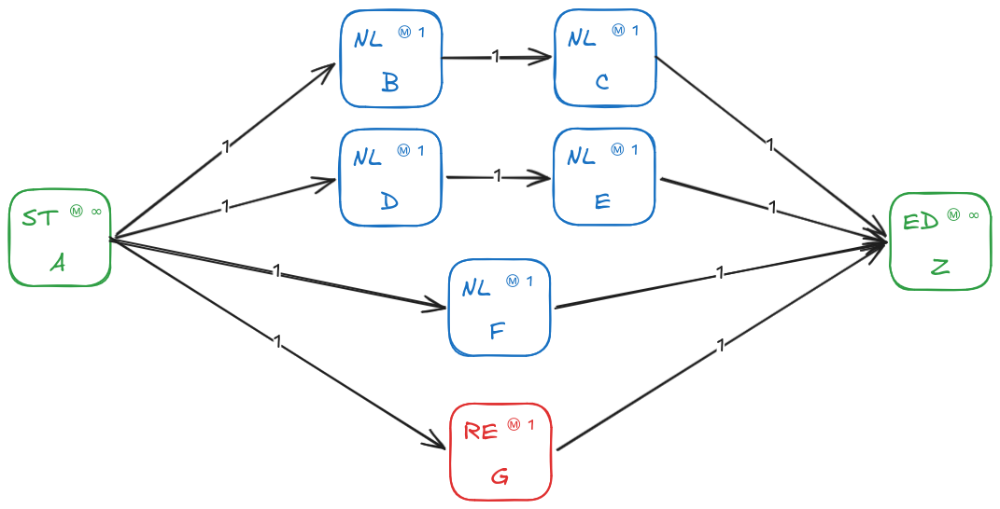
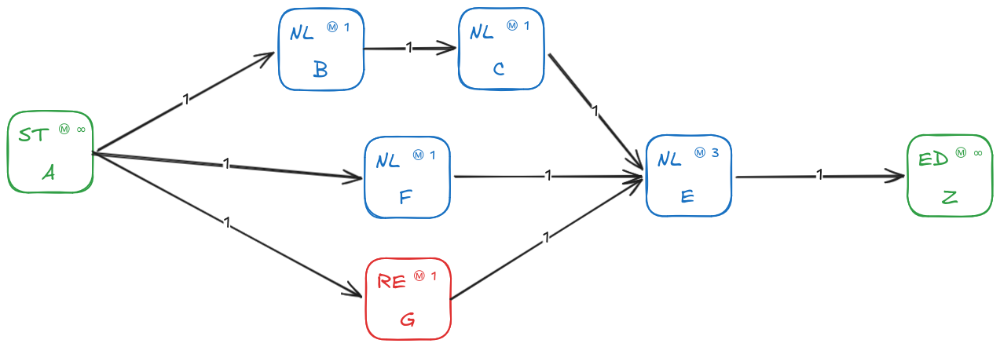
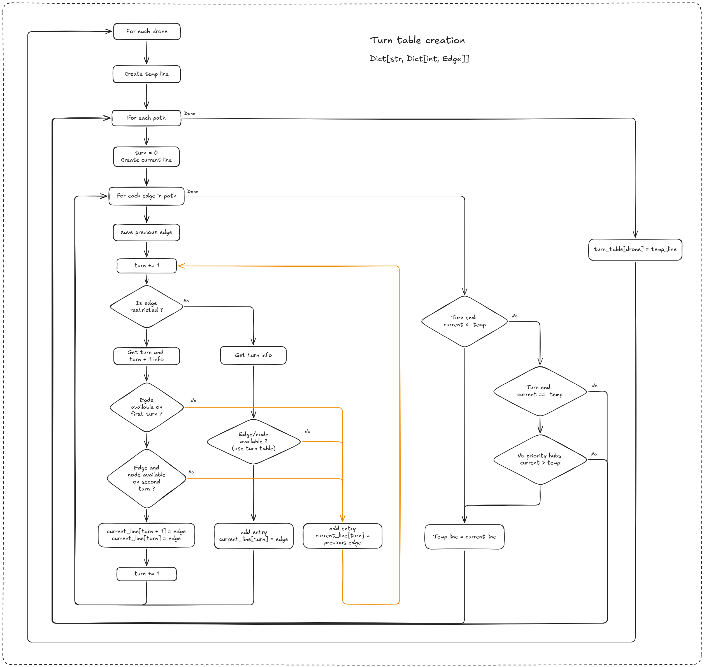

*This project has been created as part of the 42 curriculum by [flinguen](https://linguenheld.net/)*

## 42 fly in

### Description
The purpose is to parse a file which contains all information to create a
graph and some drones.  
This graph represents a map with a start and an end.  
Then we have to find the minimum turns needed to move all drones to the end.

Each turn allows you to do one move for each drones.

Constraints:
- Max drones per edge
- Max drones per node
- Restricted nodes (2 turns to go on and can't stay on the middle way)
- Priority nodes (favourite choice when two ways end in the same turn)

<video controls align="center" src="https://github.com/user-attachments/assets/55b090cc-3873-4f82-b554-cf7c5453e912">
</video>

### Instructions

This project uses [UV](https://docs.astral.sh/uv/) for automatic virtual environment management.  
Once installed, you can use it with the Makefile with these commands:

```Bash
    make install
```
```Bash
    make run
```
```Bash
    make clean
```
```Bash
    make lint
```

### Algorithm

The difficulty here is to optimise a flock of drones to avoid them to fly in Indian file.

So after having tried to dynamically perform a Dijkstra's algorithm, I finally opted to another
approach:

1. Get all paths
2. Create a 'turn table' which contains all drones with their future path (as a list of dictionary)
3. Read the table turn after turn to move all drones

Thanks to that, the algorithm tries to apply each path for each drone according
to the previous ones which are already set.


Table examples:

<div align="center">
    
</div>

|      | 0 | 1 |  2 |  3 |  4 |  5 |  6 |  7 |  8 |  9 | 10 | 11 | 12 | 13 | 14 |
| ---- |-- |-- | -- | -- | -- | -- | -- | -- | -- | -- | -- | -- | -- | -- | -- |
|  D1  | A | F |  Z |    |    |    |    |    |    |    |    |    |    |    |    |
|  D2  | A |   |  F |  Z |    |    |    |    |    |    |    |    |    |    |    |
|  D3  | A | G |  G |  Z |    |    |    |    |    |    |    |    |    |    |    |
|  D4  | A | B |  C |  Z |    |    |    |    |    |    |    |    |    |    |    |
|  D5  | A | D |  E |  Z |    |    |    |    |    |    |    |    |    |    |    |
|  D6  | A |   |    |  F |  Z |    |    |    |    |    |    |    |    |    |    |
|  D7  | A |   |  B |  C |  Z |    |    |    |    |    |    |    |    |    |    |
|  D8  | A |   |  D |  E |  Z |    |    |    |    |    |    |    |    |    |    |
|  D9  | A |   |    |    |  F |  Z |    |    |    |    |    |    |    |    |    |


<hr>
<div align="center">
    
</div>

|      | 0 | 1 |  2 |  3 |  4 |  5 |  6 |  7 |  8 |  9 | 10 | 11 | 12 | 13 | 14 |
| ---- |-- |-- | -- | -- | -- | -- | -- | -- | -- | -- | -- | -- | -- | -- | -- |
|  D1  | A | F |  E |  Z |    |    |    |    |    |    |    |    |    |    |    |
|  D2  | A |   |  F |  E |  Z |    |    |    |    |    |    |    |    |    |    |
|  D3  | A |   |    |  F |  E |  Z |    |    |    |    |    |    |    |    |    |
|  D4  | A | B |  C |  E |    |    |  Z |    |    |    |    |    |    |    |    |
|  D5  | A | G |  G |  E |    |    |    |  Z |    |    |    |    |    |    |    |


Here my diagram to create the turn table:

<div align="center">
    
</div>

### Resources
[Grokking Algorithms](https://www.manning.com/books/grokking-algorithms-second-edition)  
[Dijkstra's algorithm](https://en.wikipedia.org/wiki/Dijkstra%27s_algorithm)  
[Textual](https://textual.textualize.io/)  
[UV](https://docs.astral.sh/uv/)  
